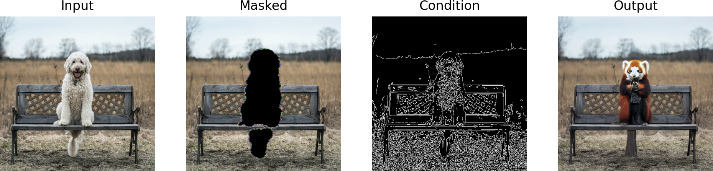
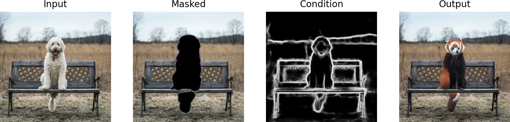
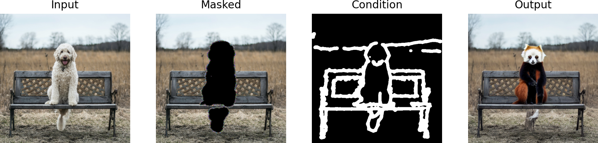
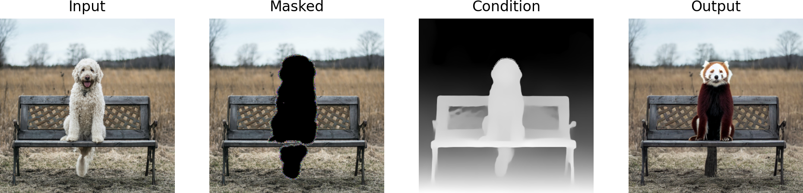
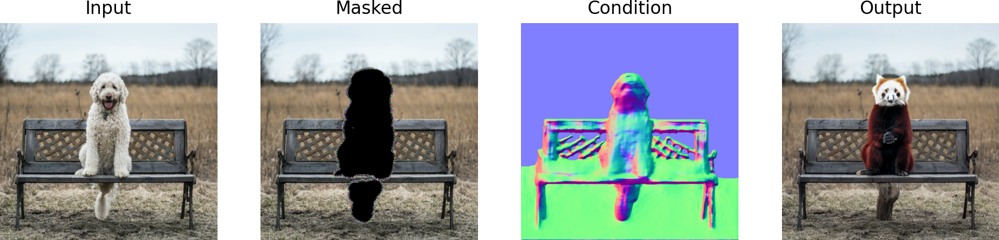
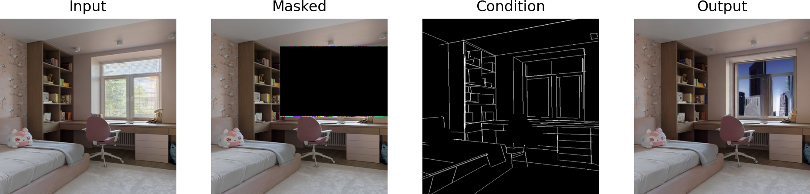
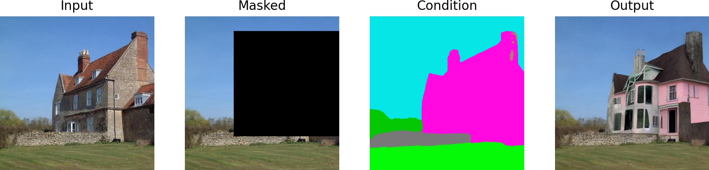
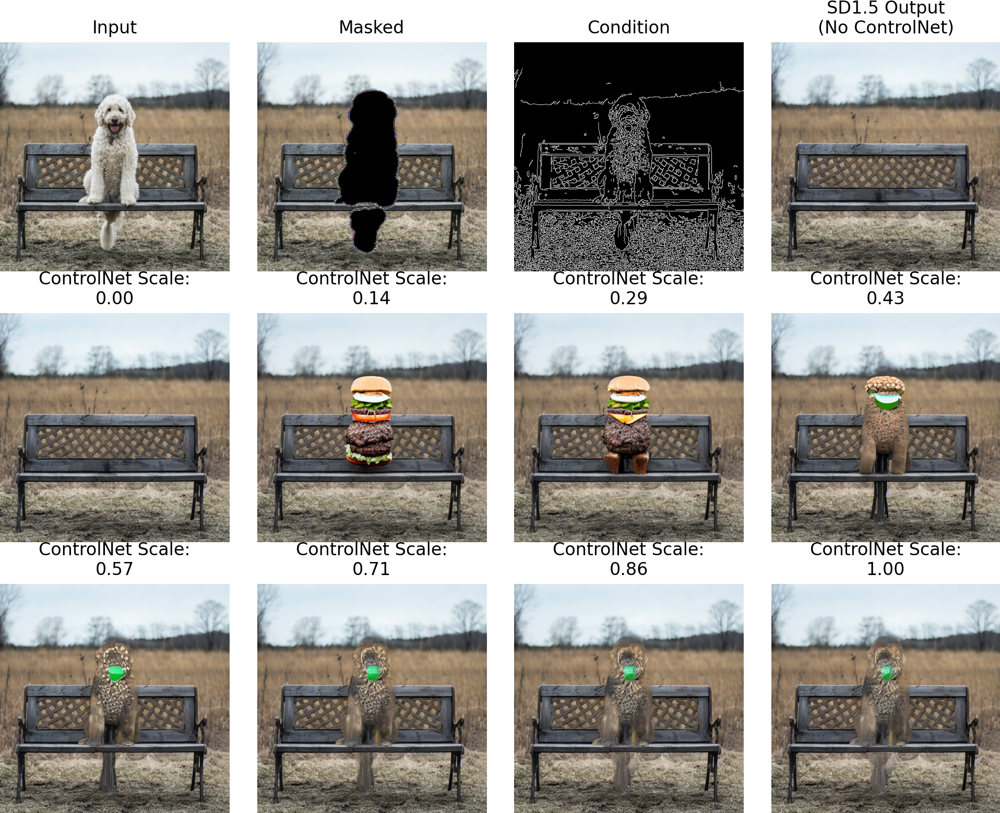

# :recycle: ControlNetInpaint
[](https://colab.research.google.com/github/mikonvergence/ControlNetInpaint/blob/main/ControlNet-with-Inpaint-Demo-colab.ipynb)

[ControlNet](https://github.com/lllyasviel/ControlNet) has proven to be a great tool for guiding StableDiffusion models with image-based hints! But what about **changing only a part of the image** based on that hint?

:crystal_ball: The initial set of models of ControlNet were not trained to work with StableDiffusion inpainting backbone, but it turns out that the results can be pretty good!

In this repository, you will find a basic example notebook that shows how this can work. **The key trick is to use the right value of the parameter** `controlnet_conditioning_scale` - while value of `1.0` often works well, it is sometimes beneficial to bring it down a bit when the controlling image does not fit the selected text prompt very well.

## Demos on 🤗  HuggingFace Using ControlNetInpaint
### :pencil2: Mask and Sketch
Check out the [HuggingFace Space](https://huggingface.co/spaces/mikonvergence/mask-and-sketch) which allows you to scribble and describe how you want to recreate a part of an image:
[](https://huggingface.co/spaces/mikonvergence/mask-and-sketch)

### :performing_arts:theaTRON
Check out the [HuggingFace Space](https://huggingface.co/spaces/mikonvergence/theaTRON) that reimagines scenes with human subjects using a text prompt:
[](https://huggingface.co/spaces/mikonvergence/theaTRON)

## Code Usage
> This code is currently compatible with `diffusers==0.14.0`. An upgrade to the latest version can be expected in the near future (currently, some breaking changes are present in `0.15.0` that should ideally be fixed on the side of the diffusers interface).

Here's an example of how this new pipeline (`StableDiffusionControlNetInpaintPipeline`) is used with the core backbone of `"runwayml/stable-diffusion-inpainting"`:
```python
# load control net and stable diffusion v1-5
controlnet = ControlNetModel.from_pretrained("lllyasviel/sd-controlnet-canny", torch_dtype=torch.float16)
pipe = StableDiffusionControlNetInpaintPipeline.from_pretrained(
     "runwayml/stable-diffusion-inpainting", controlnet=controlnet, torch_dtype=torch.float16
 )

# speed up diffusion process with faster scheduler and memory optimization
pipe.scheduler = UniPCMultistepScheduler.from_config(pipe.scheduler.config)
# remove following line if xformers is not installed
pipe.enable_xformers_memory_efficient_attention()

pipe.to('cuda')

# generate image
generator = torch.manual_seed(0)
new_image = pipe(
    text_prompt,
    num_inference_steps=20,
    generator=generator,
    image=image,
    control_image=canny_image,
    mask_image=mask_image
).images[0]
```
(Full example how to get images and run the results is available in the notebook!)

## Results
All results below have been generated using the `ControlNet-with-Inpaint-Demo.ipynb` notebook.

Let's start with turning a dog into a red panda!
### Canny Edge
**Prompt**: *"a red panda sitting on a bench"*



### HED
**Prompt**: *"a red panda sitting on a bench"*



### Scribble
**Prompt**: *"a red panda sitting on a bench"*



### Depth
**Prompt**: *"a red panda sitting on a bench"*



### Normal
**Prompt**: *"a red panda sitting on a bench"*



For the remaining modalities, the panda example doesn't really make much sense, so we use different images and prompts to illustrate the capability!

### M-LSD
**Prompt**: *"an image of a room with a city skyline view"*



### OpenPose
**Prompt**: *"a man in a knight armor"*


### Segmentation Mask
**Prompt**: *"a pink eerie scary house"*



## Challenging Example 🐕➡️🍔
Let's see how tuning the `controlnet_conditioning_scale` works out for a more challenging example of turning the dog into a cheeseburger!

In this case, we **demand a large semantic leap** and that requires a more subtle guide from the control image!



### :fast_forward: DiffusionFastForward: learn diffusion from ground up! 🎻
If you want to learn more about the process of denoising diffusion for images, check out the **open-source course** [DiffusionFastForward](https://github.com/mikonvergence/DiffusionFastForward) with colab notebooks where networks are trained from scratch on high-resolution data! :beginner:

[](https://github.com/mikonvergence/DiffusionFastForward)

### Acknowledgement
There is a related excellent repository of [ControlNet-for-Any-Basemodel](https://github.com/haofanwang/ControlNet-for-Diffusers) that, among many other things, also shows similar examples of using ControlNet for inpainting. However, that definition of the pipeline is quite different, but most importantly, does not allow for controlling the `controlnet_conditioning_scale` as an input argument.

There are other differences, such as the fact that in this implementation, only one pipeline needs to be instantiated (as opposed to two in the other one), but **the key motivation for publishing this repository is to provide a space solely focused on the application of ControlNet for inpainting.**
